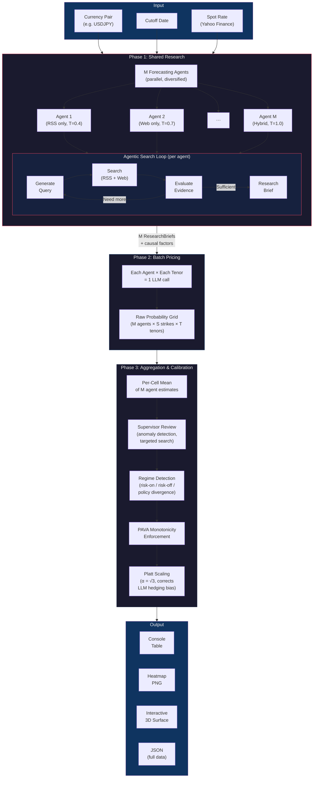
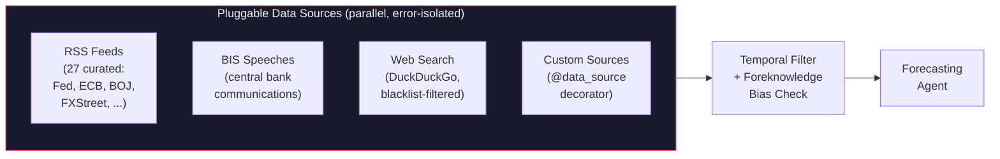
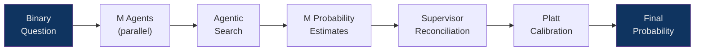

# AIA Forecaster

FX probability surface forecaster powered by LLM ensembles. Generates probability surfaces across a grid of strikes and tenors for currency pairs, supporting both P(above strike) and P(touch barrier) modes. Uses agentic search, multi-agent ensembling, and statistical calibration.

Based on the [AIA Forecaster paper](https://arxiv.org/abs/2511.07678) (Alur, Stadie et al., Bridgewater AIA Labs, 2025).

## Installation

```bash
poetry install
poetry shell
```

Set your API key in `.env`:

```
OPENAI_API_KEY=sk-...
```

## Quick Start

### Generate a probability surface

```bash
# Default: USDJPY, 5 strikes, 5 tenors, today's cutoff
forecast USDJPY

# With a specific cutoff date
forecast USDJPY 2026-02-15

# Fewer strikes for a faster run
forecast USDJPY --strikes 3

# Custom strike interval (half-yen steps instead of default 1-yen)
forecast USDJPY --strike-step 0.5

# Explicit strike levels
forecast USDJPY --strike-list 150,152.5,155,157.5,160

# Any <number><unit> tenor is accepted (D=days, W=weeks, M=months, Y=years)
forecast USDJPY --tenors 1D,3D,5D,2W,1M,3M,1Y

# Forecast mode: "above" (P(price > strike), default) or "hitting" (P(touches barrier))
forecast USDJPY --mode hitting

# Show per-cell evidence and reasoning
forecast USDJPY -e

# Verbose mode (full agent traces)
forecast USDJPY -v
```

### Forecast a single question

```bash
forecast question "Will USD/JPY be above 155 in 1 week?"
forecast question "Will EUR/USD be above 1.10 in 3 months?" --pair EURUSD
```

### Evaluate a past forecast

```bash
forecast list                    # see recent runs
forecast evaluate <RUN_ID> 1     # outcome: 1 = yes, 0 = no
```

## Usage from Python

```python
import asyncio
from aia_forecaster.fx.surface import ProbabilitySurfaceGenerator
from aia_forecaster.models import Tenor

async def main():
    gen = ProbabilitySurfaceGenerator(num_agents=3)
    surface = await gen.generate(
        pair="USDJPY",
        num_strikes=5,
        tenors=[Tenor.W1, Tenor.M1, Tenor("3D")],  # any <number><unit> tenor
        strike_step=0.5,              # half-yen intervals
        # custom_strikes=[150, 155],  # or pass explicit levels
    )
    for cell in surface.cells:
        p = cell.calibrated.calibrated_probability if cell.calibrated else None
        print(f"  {cell.strike} / {cell.tenor.value}: {p}")
    return surface

surface = asyncio.run(main())
```

### Single question from Python

```python
import asyncio
from aia_forecaster.ensemble.engine import EnsembleEngine
from aia_forecaster.calibration.platt import calibrate
from aia_forecaster.models import ForecastQuestion

async def main():
    engine = EnsembleEngine(num_agents=5)
    question = ForecastQuestion(text="Will USD/JPY be above 155 in 1 week?")
    result = await engine.run(question)
    cal = calibrate(result.final_probability)
    print(f"Calibrated: {cal.calibrated_probability:.4f}")

asyncio.run(main())
```

## Architecture

### Pipeline Overview



### Data Sources



### Single-Question Pipeline



### Efficiency: Shared Research vs Naive

The surface generator uses a shared-research approach to avoid redundant search across cells (~94% fewer LLM calls vs naive per-cell ensembles):

| Approach | Formula | LLM Calls |
|----------|---------|-----------|
| **Naive per-cell** | 10 agents × 5 strikes × 5 tenors × ~12 calls/cell | **~3,000** |
| **Shared research** | 10 agents × ~7 research + 10 × 5 pricing + 1 supervisor | **~120** |

### Key Components

| Component | File | Purpose |
|-----------|------|---------|
| Forecasting Agent | `agents/forecaster.py` | Agentic search + probability estimation |
| Supervisor Agent | `agents/supervisor.py` | Disagreement resolution, surface review |
| Ensemble Engine | `ensemble/engine.py` | Parallel agent orchestration |
| Surface Generator | `fx/surface.py` | Two-phase surface pipeline |
| Platt Calibration | `calibration/platt.py` | LLM hedging bias correction |
| Monotonicity (PAVA) | `calibration/monotonicity.py` | Strike-monotonicity enforcement |
| Base Rates | `fx/base_rates.py` | Forward rates, consensus, vol, statistical anchoring |
| Data Source Registry | `search/registry.py` | Pluggable data source framework |

## Adding Custom Data Sources

You can plug any dataset into the forecasting pipeline by writing a single decorated async function. Agents will automatically fetch from it alongside the built-in RSS feeds.

### Minimal example

```python
# my_sources.py  (import this file at startup so the decorator runs)
from aia_forecaster.search.registry import data_source
from aia_forecaster.models import SearchResult

@data_source("my_csv")
async def fetch_csv_data(pair: str, cutoff_date, **kwargs) -> list[SearchResult]:
    """Load headlines from a local CSV file."""
    import csv
    from pathlib import Path

    results = []
    for row in csv.DictReader(open(Path("data") / f"{pair}.csv")):
        results.append(SearchResult(
            query=f"csv:{pair}",
            title=row["headline"],
            snippet=row["body"][:500],
            url=row.get("url", ""),
            source="my_csv",
        ))
    return results[: kwargs.get("max_results", 20)]
```

### Requirements

- The function **must** be `async` and return `list[SearchResult]`.
- Required parameters: `pair` (`str`, e.g. `"USDJPY"`) and `cutoff_date` (`datetime.date`).
- Optional `**kwargs` receives `max_results`, `max_age_hours`, etc. from the agent.
- All registered sources run **in parallel** with error isolation — one failing source won't break the others.

### More examples

```python
# API data source
@data_source("bloomberg_api")
async def fetch_bloomberg(pair: str, cutoff_date, **kwargs):
    import httpx
    async with httpx.AsyncClient() as client:
        resp = await client.get(f"https://api.example.com/news/{pair}")
        return [
            SearchResult(query=f"bloomberg:{pair}", title=item["title"],
                         snippet=item["summary"], url=item["link"], source="bloomberg")
            for item in resp.json()["articles"]
        ]

# Database source
@data_source("internal_db")
async def fetch_from_db(pair: str, cutoff_date, **kwargs):
    import aiosqlite
    async with aiosqlite.connect("data/research.db") as db:
        rows = await db.execute_fetchall(
            "SELECT title, body, url FROM articles WHERE pair = ? AND date <= ?",
            (pair, cutoff_date.isoformat()),
        )
        return [
            SearchResult(query=f"db:{pair}", title=r[0], snippet=r[1], url=r[2], source="internal_db")
            for r in rows
        ]
```

### Imperative registration

If you prefer not to use the decorator:

```python
from aia_forecaster.search.registry import register

async def my_source(pair, cutoff_date, **kwargs):
    ...

register("my_source", my_source)
```

### Inspecting registered sources

```python
from aia_forecaster.search.registry import list_sources
print(list_sources())  # ['rss', 'my_csv', 'bloomberg_api', ...]
```

## Data Source Toggling & Comparison

You can run the pipeline with specific data sources enabled or disabled to understand which sources drive forecast differences.

### Available sources

| Token | Registry name | Description |
|-------|--------------|-------------|
| `rss` | `rss` | 27 curated RSS feeds (Fed, ECB, BOJ, FXStreet, etc.) |
| `bis` | `bis_speeches` | BIS central bank speech transcripts |
| `web` | — | DuckDuckGo agentic web search |

### Running with specific sources

```bash
# Only RSS feeds (no web search, no BIS)
forecast USDJPY --sources rss

# Only web search
forecast USDJPY --sources web

# RSS + web search (no BIS)
forecast USDJPY --sources rss,web

# All sources (default behavior, no flag needed)
forecast USDJPY
```

When `--sources` is specified, the source label is encoded in the output filename:

```
data/forecasts/USDJPY_2026-02-18_rss.json
data/forecasts/USDJPY_2026-02-18_web.json
data/forecasts/USDJPY_2026-02-18_rss+web.json
data/forecasts/USDJPY_2026-02-18.json          # default (all sources)
```

### Comparing surfaces

After generating surfaces with different source configs, compare them side-by-side:

```bash
forecast compare data/forecasts/USDJPY_2026-02-18_rss.json \
                 data/forecasts/USDJPY_2026-02-18_web.json \
                 data/forecasts/USDJPY_2026-02-18.json
```

This produces three outputs:
- **Heatmaps PNG** — individual surfaces (RdYlGn) + pairwise difference heatmaps (RdBu diverging, centered at 0)
- **Scatter PNG** — probability-vs-strike and probability-vs-tenor curves overlaid with different line styles per source config
- **Interactive HTML** — Plotly heatmap with a dropdown to toggle between surfaces and diff views

You can specify an output directory:

```bash
forecast compare file1.json file2.json --output-dir results/comparisons
```

### Python API

```python
from aia_forecaster.fx.surface import ProbabilitySurfaceGenerator
from aia_forecaster.models import SourceConfig

# Run with only RSS sources
config = SourceConfig(registry_sources=["rss"], web_search_enabled=False)
gen = ProbabilitySurfaceGenerator(num_agents=5, source_config=config)
surface = await gen.generate(pair="USDJPY")

# The output JSON includes the source_config for provenance
print(surface.source_config.label)  # "rss"
```

## Strikes & Tenors

### Strike controls

By default, strikes are auto-generated around the live spot rate using pair-specific step sizes (1.0 yen for USDJPY, `typical_daily_range` for others).

| Flag | Description | Example |
|------|-------------|---------|
| `--strikes N` | Number of auto-generated strikes (default: 5) | `--strikes 11` |
| `--strike-step X` | Override the interval between strikes | `--strike-step 0.5` |
| `--strike-list X,Y,Z` | Explicit strike prices (ignores `--strikes` and `--strike-step`) | `--strike-list 150,152.5,155,157.5,160` |

```bash
# 11 strikes at default 1-yen intervals
forecast USDJPY --strikes 11

# 9 strikes at half-yen intervals
forecast USDJPY --strikes 9 --strike-step 0.5

# Exactly these 4 levels
forecast USDJPY --strike-list 152,154,156,158
```

### Tenor controls

Tenors accept any `<number><unit>` string:

| Unit | Meaning | Examples |
|------|---------|----------|
| `D` | Days | `1D`, `3D`, `5D`, `10D` |
| `W` | Weeks | `1W`, `2W`, `3W` |
| `M` | Months | `1M`, `2M`, `3M`, `6M`, `9M` |
| `Y` | Years | `1Y`, `2Y` |

Default (when `--tenors` is omitted): `1D,1W,1M,3M,6M`.

```bash
# Fine-grained short-horizon
forecast USDJPY --tenors 1D,3D,5D,1W,2W

# Full curve out to 1 year
forecast USDJPY --tenors 1D,1W,1M,3M,6M,1Y

# Single tenor
forecast USDJPY --tenors 1M

# Any combination you want
forecast USDJPY --tenors 3D,10D,1M,6M,2Y
```

### Python API

```python
from aia_forecaster.fx.surface import ProbabilitySurfaceGenerator
from aia_forecaster.models import Tenor

gen = ProbabilitySurfaceGenerator(num_agents=3)

# Custom strike step
surface = await gen.generate(pair="USDJPY", num_strikes=9, strike_step=0.5)

# Explicit strikes
surface = await gen.generate(pair="USDJPY", custom_strikes=[150, 152.5, 155, 157.5, 160])

# Predefined tenor constants
surface = await gen.generate(pair="USDJPY", tenors=[Tenor.W1, Tenor.W2, Tenor.M1, Tenor.Y1])

# Arbitrary tenors (any <number><unit> string)
surface = await gen.generate(pair="USDJPY", tenors=[Tenor("3D"), Tenor("5D"), Tenor("2W")])
```

## Configuration

Settings are loaded from environment variables or `.env`:

| Variable | Default | Description |
|----------|---------|-------------|
| `LLM_MODEL` | `gpt-4o` | LLM model (provider/model-name or just model-name) |
| `NUM_AGENTS` | `10` | Number of forecasting agents |
| `MAX_SEARCH_ITERATIONS` | `5` | Max search iterations per agent |
| `PLATT_ALPHA` | `sqrt(3)` | Calibration coefficient |
| `DEFAULT_PAIR` | `USDJPY` | Default currency pair |

Override at the CLI:

```bash
forecast USDJPY --agents 5 --model openai/gpt-4o
```

## Output

Each surface run produces:
- **Console table** with color-coded probabilities
- **Heatmap PNG** saved to `data/forecasts/PAIR_DATE.png`
- **Scatter plots PNG** (prob vs strike, prob vs tenor, Platt scaling effect) saved to `data/forecasts/PAIR_DATE_scatter.png`
- **Interactive 3D surface** (HTML/Plotly) saved to `data/forecasts/PAIR_DATE.html`
- **JSON file** with full surface data (probabilities, evidence, reasoning)

## Supported Pairs

| Pair | Default strike step | Typical daily range | Override with |
|------|-------------------|---------------------|---------------|
| `USDJPY` | 1.0 yen | ~1.0 | `--strike-step 0.5` |
| `EURUSD` | 0.008 | ~0.008 | `--strike-step 0.005` |
| `GBPUSD` | 0.010 | ~0.010 | `--strike-step 0.005` |

Custom pairs can be registered via `register_pair()` — see `fx/pairs.py`.

## Connecting Your Market Data

The forecasting pipeline uses a **base rate system** that anchors LLM probability estimates to quantitative market data. Out of the box it computes carry-adjusted forward rates from interest-rate parity. You can plug in your company's consensus forecasts to replace the forward as the distribution center.

### How the base rate resolves

The system picks a center for the probability distribution in this order:

| Priority | Source | What it is | When it's used |
|----------|--------|------------|----------------|
| 1 | **Consensus provider** | Analyst forecasts, internal models, options-implied | When you register a provider via `set_consensus_provider()` |
| 2 | **Forward rate** | Carry math from interest-rate parity | Default — always computed for context |
| 3 | **Spot rate** | Zero drift, last resort | Only if no interest rates are available at all |

When consensus is available, the forward rate and interest rates are **not computed** — the system skips them entirely.

### Plugging in consensus forecasts

Register a function that returns your company's consensus rate for a given pair and tenor:

```python
from aia_forecaster.fx import set_consensus_provider
from aia_forecaster.models import Tenor

def my_consensus(pair: str, spot: float, tenor: Tenor) -> tuple[float, str] | None:
    """Return (consensus_rate, source_label) or None if unavailable."""
    # Example: look up from your internal data
    rate = your_internal_api.get_forecast(pair, str(tenor))
    if rate is None:
        return None
    return rate, "internal_model"  # source_label appears in agent context

set_consensus_provider(my_consensus)
```

The provider function receives:
- `pair` — e.g. `"USDJPY"` (always uppercase)
- `spot` — current spot rate
- `tenor` — a `Tenor` object (has `.days`, `.trading_days`, `.label` properties; `str(tenor)` gives e.g. `"1M"`)

It should return:
- `(consensus_rate, source_label)` — the rate and a string describing the source
- `None` — when no consensus is available for this pair/tenor (system falls back to forward)

Exceptions are caught and logged automatically — one failing lookup won't crash the pipeline.

#### Common setups

**Bloomberg or Refinitiv:**
```python
def bloomberg_consensus(pair, spot, tenor):
    rate = blp.get_fx_forecast(pair, tenor.label)
    return (rate, "bloomberg") if rate else None

set_consensus_provider(bloomberg_consensus)
```

**Static CSV file:**
```python
import csv

forecasts = {}
for row in csv.DictReader(open("forecasts.csv")):
    forecasts[(row["pair"], row["tenor"])] = float(row["rate"])

def csv_consensus(pair, spot, tenor):
    rate = forecasts.get((pair, str(tenor)))
    return (rate, "csv_forecast") if rate else None

set_consensus_provider(csv_consensus)
```

**Database lookup:**
```python
def db_consensus(pair, spot, tenor):
    row = db.execute(
        "SELECT rate FROM consensus WHERE pair=? AND tenor=?",
        (pair, str(tenor))
    ).fetchone()
    return (row[0], "internal_db") if row else None

set_consensus_provider(db_consensus)
```

### Interest rates (only used without consensus)

When no consensus provider is registered, the system falls back to forward rates computed from interest-rate parity. The rate resolution order is:

1. **Dynamic fetch** (Yahoo Finance `^IRX`) — currently only USD
2. **Static fallback** (`FALLBACK_POLICY_RATES` in `fx/base_rates.py`) — all major currencies
3. **Zero rate** — if a currency is completely unknown

To update the static fallback rates (e.g. after a central bank decision), edit `FALLBACK_POLICY_RATES` in `fx/base_rates.py`:

```python
FALLBACK_POLICY_RATES = {
    "USD": 0.0450,  # Federal Reserve
    "JPY": 0.0050,  # Bank of Japan
    "EUR": 0.0275,  # ECB
    "GBP": 0.0425,  # Bank of England
    # ... add your currencies here
}
```

### What agents see

When the pipeline runs, each forecasting agent receives a context block like this:

**With consensus registered:**
```
BASE RATE CONTEXT (statistical anchor):
Current spot: USD/JPY = 154.50
1 month consensus: USD/JPY = 150.00 (src: analyst_survey)
Annualized vol: 9.0% (dynamic)
...
Note: Base rate is anchored to analyst_survey (consensus view).
```

**Without consensus (default — falls back to forward):**
```
BASE RATE CONTEXT (statistical anchor):
Current spot: USD/JPY = 154.50
1 month forward: USD/JPY = 154.11 (carry: USD 3.60% vs JPY 0.50%, net -3.10%, src: dynamic/fallback)
Annualized vol: 9.0% (dynamic)
...
Note: Base rate is anchored to forward (carry-adjusted).
```

### Clearing the provider

To revert to forward-only mode:

```python
set_consensus_provider(None)
```
