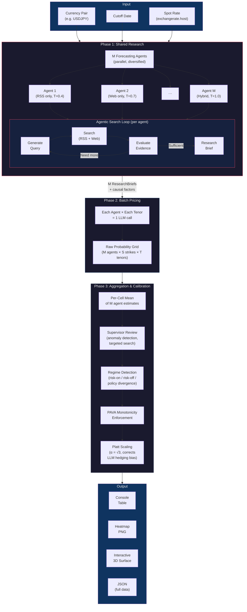
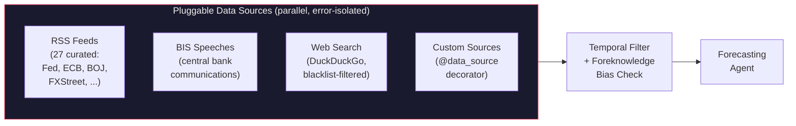
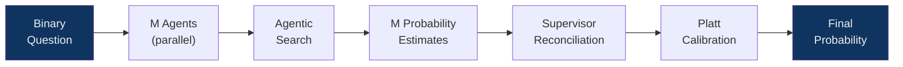

# AIA Forecaster

FX probability surface forecaster powered by LLM ensembles. Generates probability surfaces across a grid of strikes and tenors for currency pairs, supporting both P(above strike) and P(touch barrier) modes. Uses agentic search, multi-agent ensembling, and statistical calibration.

Based on the [AIA Forecaster paper](https://arxiv.org/abs/2511.07678) (Alur, Stadie et al., Bridgewater AIA Labs, 2025).

## What Is This?

Instead of predicting a single price, this system generates a **probability surface** — answering questions like:

> "What is the probability that USD/JPY will be above 155.0 in 1 month?"

The output is a grid of probabilities across multiple **strikes** (price levels) and **tenors** (time horizons), comparable to what you'd derive from an options market — but driven by news and macro analysis rather than market pricing.

The system combines four techniques from the AIA Forecaster paper:
1. **Agentic, adaptive search** — LLM agents control their own query strategy, iteratively searching for evidence
2. **Multi-agent ensembling** — 10 independent agents with diversity in temperature, search depth, and source mix
3. **Statistical calibration** — Platt scaling (α = √3) corrects systematic LLM hedging bias
4. **Foreknowledge bias mitigation** — temporal cutoffs and prediction market blacklists prevent data leakage

## Installation

```bash
poetry install
poetry shell
```

Set your API key in `.env`:

```
OPENAI_API_KEY=sk-...
```

## Quick Start

### Generate a probability surface

```bash
# Default: USDJPY, 5 strikes, 5 tenors, today's cutoff
forecast USDJPY

# With a specific cutoff date
forecast USDJPY 2026-02-15

# Fewer strikes for a faster run
forecast USDJPY --strikes 3

# Custom strike interval (half-yen steps instead of default 1-yen)
forecast USDJPY --strike-step 0.5

# Explicit strike levels
forecast USDJPY --strike-list 150,152.5,155,157.5,160

# Any <number><unit> tenor is accepted (D=days, W=weeks, M=months, Y=years)
forecast USDJPY --tenors 1D,3D,5D,2W,1M,3M,1Y

# Forecast mode: "above" (P(price > strike), default) or "hitting" (P(touches barrier))
forecast USDJPY --mode hitting

# Show per-cell evidence and reasoning
forecast USDJPY -e

# Verbose mode (full agent traces)
forecast USDJPY -v
```

### Forecast a single question

```bash
forecast question "Will USD/JPY be above 155 in 1 week?"
forecast question "Will EUR/USD be above 1.10 in 3 months?" --pair EURUSD
```

### Evaluate a past forecast

```bash
forecast list                    # see recent runs
forecast evaluate <RUN_ID> 1     # outcome: 1 = yes, 0 = no
```

## How It Works

The pipeline processes a currency pair through three phases:

```
┌──────────────────────────────────────────────────────────┐
│  Phase 1: RESEARCH  (M agents in parallel)               │
│                                                          │
│  Each agent independently searches news via an           │
│  agentic loop: generate query → search → evaluate →      │
│  decide "search more" or "ready" → repeat                │
│                                                          │
│  Output: M ResearchBriefs, each with themes,             │
│  causal factors, and evidence                            │
├──────────────────────────────────────────────────────────┤
│  Phase 2: PRICING  (M agents × T tenors)                 │
│                                                          │
│  Each agent prices ALL strikes for each tenor in a       │
│  single LLM call, using its own research + market        │
│  context (consensus, strike distances) as anchors        │
│                                                          │
│  Output: Raw probability grid (M × S × T)               │
├──────────────────────────────────────────────────────────┤
│  Phase 3: AGGREGATION & CALIBRATION                      │
│                                                          │
│  Per-cell mean of M agent estimates                      │
│  → Supervisor reviews surface for anomalies              │
│  → PAVA monotonicity enforcement                         │
│  → Platt scaling calibration (α = √3)                    │
│  → Final monotonicity pass                               │
│                                                          │
│  Output: heatmap, 3D surface, JSON, PDF                  │
└──────────────────────────────────────────────────────────┘
```

### Why two phases?

The shared-research approach avoids redundant search across cells, reducing LLM calls by ~94%:

| Approach | Formula | LLM Calls |
|----------|---------|-----------|
| **Naive per-cell** | 10 agents × 5 strikes × 5 tenors × ~12 calls/cell | **~3,000** |
| **Shared research** | 10 agents × ~7 research + 10 × 5 pricing + 1 supervisor | **~120** |

### Causal reasoning

Agents don't just output probabilities — they extract structured **causal factors** that explain *why* prices might move:

```
Event:      "Fed holds rates at 4.5%"
Channel:    "interest_rate_differential"
Direction:  "bearish_quote"  (bearish for JPY)
Magnitude:  "medium"
Confidence: 0.75
```

The supervisor compares causal chains across agents to pinpoint where they disagree (factual disputes vs. channel weighting vs. magnitude estimates), then runs targeted searches to resolve specific disagreements.

### Probability math

Two forecast modes, each with different underlying models:

**ABOVE mode** — "What is P(price > K at expiry)?"
```
P(S_T > K) = Φ(d2)
where d2 = (ln(Center / K) - 0.5 × σ² × t) / (σ × √t)
```

**HITTING mode** — "What is P(price touches K before expiry)?"
```
First-passage probability with drift
ν_T = ln(Center / S) - 0.5 × σ² × t
Separate formulas for barriers above vs below spot
```

The "Center" is either a consensus forecast (if plugged in) or the carry-adjusted forward rate.

## Directory Structure

```
AIA-Forecaster-CC/
├── src/aia_forecaster/          # All source code
│   ├── __init__.py              # Package init, loads company extensions
│   ├── config.py                # Settings from .env (pydantic-settings)
│   ├── models.py                # All data models (Tenor, ForecastQuestion, etc.)
│   ├── main.py                  # CLI entry point ("forecast" command)
│   │
│   ├── agents/                  # LLM-powered agents
│   │   ├── forecaster.py        # Individual forecasting agent
│   │   └── supervisor.py        # Disagreement reconciliation agent
│   │
│   ├── ensemble/
│   │   └── engine.py            # Orchestrates M parallel agents
│   │
│   ├── calibration/
│   │   ├── platt.py             # Platt scaling (fixes LLM hedging bias)
│   │   └── monotonicity.py      # PAVA algorithm (enforces logical constraints)
│   │
│   ├── fx/
│   │   ├── base_rates.py        # Consensus provider, market context formatting
│   │   ├── rates.py             # Spot rate fetching (exchangerate.host)
│   │   ├── pairs.py             # Currency pair configs + strike generation
│   │   ├── surface.py           # ProbabilitySurfaceGenerator (orchestrates everything)
│   │   ├── explanation.py       # Evidence extraction from agent outputs
│   │   ├── compare.py           # Compare 2+ surfaces visually
│   │   └── pdf_report.py        # PDF report generation
│   │
│   ├── llm/
│   │   └── client.py            # LLMClient (langchain-openai, pluggable provider)
│   │
│   ├── search/
│   │   ├── registry.py          # @data_source decorator, pluggable sources
│   │   ├── rss.py               # 27 curated RSS feeds (central banks, FX, macro)
│   │   ├── bis.py               # BIS speeches (central bank comms)
│   │   ├── web.py               # DuckDuckGo search + blacklist
│   │   ├── relevance.py         # Heuristic relevance scoring (no LLM)
│   │   └── web_providers.py     # Pluggable web search provider registry
│   │
│   ├── evaluation/
│   │   └── metrics.py           # Brier score + decomposition
│   │
│   └── storage/
│       ├── cache.py             # File-based search cache (SHA256 keys, TTL)
│       └── database.py          # SQLite for persisting forecast runs
│
├── company.example/              # Template for company-specific extensions
│   ├── config.py                # Override settings
│   ├── pairs.py                 # Register exotic/NDF pairs
│   ├── llm.py                   # Custom LLM provider
│   └── search/bloomberg.py      # Bloomberg data source example
│
├── tests/                        # Test suite (pytest)
│
├── data/
│   ├── cache/                   # Cached search results (SHA256-keyed JSON, 6h TTL)
│   ├── forecasts/               # Output: PNG, HTML, JSON, PDF
│   └── forecasts.db             # SQLite run history
│
└── pyproject.toml               # Dependencies (Poetry)
```

## Architecture Deep Dive

### Pipeline Overview


```mermaid
flowchart TB
    subgraph Input
        pair["Currency Pair\n(e.g. USDJPY)"]
        cutoff["Cutoff Date"]
        spot["Spot Rate\n(exchangerate.host)"]
    end

    pair & cutoff & spot --> Phase1

    subgraph Phase1["Phase 1: Shared Research"]
        direction TB
        agents["M Forecasting Agents\n(parallel, diversified)"]
        agents --> a1["Agent 1\n(RSS only, T=0.4)"]
        agents --> a2["Agent 2\n(Web only, T=0.7)"]
        agents --> dots["···"]
        agents --> aM["Agent M\n(Hybrid, T=1.0)"]

        subgraph search["Agentic Search Loop (per agent)"]
            direction LR
            q1["Generate\nQuery"] --> s1["Search\n(RSS + Web)"]
            s1 --> ev["Evaluate\nEvidence"]
            ev -->|"Need more"| q1
            ev -->|"Sufficient"| brief["Research\nBrief"]
        end

        a1 & a2 & aM --> search
    end

    subgraph Phase2["Phase 2: Batch Pricing"]
        direction TB
        pricing["Each Agent × Each Tenor\n= 1 LLM call"]
        pricing --> grid["Raw Probability Grid\n(M agents × S strikes × T tenors)"]
    end

    Phase1 -->|"M ResearchBriefs\n+ causal factors"| Phase2

    subgraph Phase3["Phase 3: Aggregation & Calibration"]
        direction TB
        mean["Per-Cell Mean\nof M agent estimates"]
        mean --> sup["Supervisor Review\n(anomaly detection,\ntargeted search)"]
        sup --> regime["Regime Detection\n(risk-on / risk-off /\npolicy divergence)"]
        regime --> pava["PAVA Monotonicity\nEnforcement"]
        pava --> platt["Platt Scaling\n(α = √3, corrects\nLLM hedging bias)"]
    end

    Phase2 --> Phase3

    subgraph Output
        direction LR
        table["Console\nTable"]
        png["Heatmap\nPNG"]
        html["Interactive\n3D Surface"]
        json["JSON\n(full data)"]
    end

    Phase3 --> Output

    style Phase1 fill:#1a1a2e,stroke:#e94560,color:#eee
    style Phase2 fill:#1a1a2e,stroke:#0f3460,color:#eee
    style Phase3 fill:#1a1a2e,stroke:#16213e,color:#eee
    style Input fill:#0f3460,stroke:#533483,color:#eee
    style Output fill:#0f3460,stroke:#533483,color:#eee
    style search fill:#16213e,stroke:#e94560,color:#eee
```

### Data Sources


```mermaid
flowchart LR
    subgraph sources["Pluggable Data Sources (parallel, error-isolated)"]
        rss["RSS Feeds\n(27 curated:\nFed, ECB, BOJ,\nFXStreet, ...)"]
        bis["BIS Speeches\n(central bank\ncommunications)"]
        web["Web Search\n(DuckDuckGo,\nblacklist-filtered)"]
        custom["Custom Sources\n(@data_source\ndecorator)"]
    end

    sources --> filter["Temporal Filter\n+ Foreknowledge\nBias Check"]
    filter --> agent["Forecasting\nAgent"]

    style sources fill:#1a1a2e,stroke:#e94560,color:#eee
```

### Single-Question Pipeline


```mermaid
flowchart LR
    Q["Binary\nQuestion"] --> agents["M Agents\n(parallel)"]
    agents --> search["Agentic\nSearch"]
    search --> probs["M Probability\nEstimates"]
    probs --> sup["Supervisor\nReconciliation"]
    sup --> cal["Platt\nCalibration"]
    cal --> P["Final\nProbability"]

    style Q fill:#0f3460,stroke:#533483,color:#eee
    style P fill:#0f3460,stroke:#533483,color:#eee
```

### Key Components

| Component | File | Purpose |
|-----------|------|---------|
| Forecasting Agent | `agents/forecaster.py` | Agentic search + probability estimation |
| Supervisor Agent | `agents/supervisor.py` | Disagreement resolution, surface review |
| Ensemble Engine | `ensemble/engine.py` | Parallel agent orchestration |
| Surface Generator | `fx/surface.py` | Two-phase surface pipeline |
| Platt Calibration | `calibration/platt.py` | LLM hedging bias correction |
| Monotonicity (PAVA) | `calibration/monotonicity.py` | Strike-monotonicity enforcement |
| Base Rates | `fx/base_rates.py` | Consensus provider, market context formatting |
| Data Source Registry | `search/registry.py` | Pluggable data source framework |

## Components in Detail

### Data Models (`models.py`)

Everything is typed with Pydantic. The key types:

| Model | Purpose |
|---|---|
| `Tenor` | Time horizon — `"1D"`, `"1W"`, `"1M"`, `"3M"`, `"6M"`, `"1Y"`. Has `.days`, `.trading_days`, `.label` properties |
| `ForecastQuestion` | A single binary question (pair, spot, strike, tenor, cutoff_date) |
| `CausalFactor` | A structured cause: event → channel → direction + magnitude + confidence |
| `ResearchBrief` | Agent's research output: themes, causal factors, evidence, macro summary |
| `BatchPricingResult` | One agent's prices for all strikes in a single tenor |
| `SurfaceCell` | One cell in the probability grid (strike × tenor → probability) |
| `ProbabilitySurface` | The full output grid with metadata, causal factors, and regime |
| `ForecastMode` | Enum: `ABOVE` (terminal price) vs `HITTING` (barrier touch) |
| `SearchMode` | Enum: `RSS_ONLY`, `WEB_ONLY`, `HYBRID` |
| `SourceConfig` | Controls which data sources (registry names, web search toggle) |

### Search Layer (`search/`)

Three data sources work together, all running in parallel with error isolation:

**RSS Feeds** (`rss.py`) — 27 curated feeds organized by category:
- **Central banks**: Fed, ECB, BOJ, BOE, RBA, RBNZ, SNB, BoC
- **FX-specific**: FXStreet, Forexlive, DailyFX, Investing.com
- **Macro data**: BLS, BEA, Eurostat
- **Commodity/energy**: OilPrice
- **Geopolitical**: WTO
- **General financial**: Reuters, BBC, CNBC
- **Regional**: Japan Times, Kyodo, Guardian, SMH

Each feed has currency targeting — e.g., the Fed feed only returns results for USD pairs.

**Web Search** (`web.py`) — DuckDuckGo with safety guardrails:
- **Filtered**: Utility sites (calculator.net, epochconverter.com, etc.) that add noise
- **Prediction markets allowed**: Polymarket, Metaculus, Kalshi, etc. provide valuable probability signals
- **Temporal filtering**: Enforced cutoff date via DDG timelimit
- **Query sanitization**: Strips advanced operators (`site:`, `AND/OR`, parentheses) that DDG doesn't support

**BIS Speeches** (`bis.py`) — Central bank speech monitoring for policy signals.

**Relevance Scoring** (`relevance.py`) — Every search result gets a heuristic 0.0–1.0 score (no LLM needed):

| Signal | Score |
|--------|-------|
| Pair in title (e.g., "EUR/USD") | +0.40 |
| Pair in snippet only | +0.25 |
| Both currencies mentioned | +0.25 |
| One currency keyword | +0.15 |
| Per general FX keyword (capped) | +0.02 each, max +0.15 |
| Central bank source for the pair | +0.10 |
| Different pair in title | -0.20 |
| Unrelated asset class | -0.15 |

Special commodity currency rules: AUD→gold/iron/copper, CAD→oil/crude, NOK→oil, NZD→dairy, ZAR→gold/platinum, CLP→copper.

Results below the threshold (default 0.20) are filtered out before agents see them.

**Data Source Registry** (`registry.py`) — A `@data_source` decorator lets you plug in any custom source. All registered sources are fetched in parallel with error isolation — one failing source won't break the others.

### Forecasting Agent (`agents/forecaster.py`)

Each agent does two jobs:

**Job 1 — Research**: Agentic search for a currency pair
1. Gather passive data (RSS feeds, BIS speeches based on search mode)
2. Filter by relevance score
3. Run an **agentic search loop**: LLM generates a query → executes via DuckDuckGo → reviews results → decides `"SEARCH"` (more) or `"FORECAST"` (ready) → repeat (3–7 iterations depending on the agent)
4. Summarize into a `ResearchBrief` with macro themes and causal factors

**Job 2 — Pricing**: Given its research, price all strikes for one tenor
1. Receive the research brief + statistical base rates from `base_rates.py`
2. One LLM call produces probabilities for ALL strikes at once
3. Return `BatchPricingResult` with per-strike probabilities + reasoning

**Built-in diversity** across the M agents (default 10):

| Dimension | Range | Purpose |
|-----------|-------|---------|
| Temperature | 0.4 → 1.0 | Exploration vs. precision |
| Search depth | 3 → 7 iterations | Thoroughness variation |
| Search mode | RSS_ONLY → WEB_ONLY → HYBRID (cycling) | Source diversity |

### Supervisor Agent (`agents/supervisor.py`)

The supervisor resolves disagreements — it does **not** re-evaluate everything from scratch. (The paper found that naive LLM aggregation performs *worse* than simple averaging.)

1. **Skip if tight agreement** — If the spread across agents < 0.10, the mean stands
2. **Analyze disagreements** — Compare causal chains: is it a factual dispute? A channel weighting difference? A magnitude estimate?
3. **Targeted search** — Run up to 3 specific searches to fact-check the dispute
4. **Regime detection** — Classify the macro environment:
   - `risk_on` / `risk_off` / `policy_divergence` / `carry_unwind` / `mixed`
   - Maps regime to channel weights (e.g., "risk_on" → high weight on carry trade, portfolio flows)
5. **Surface review** — Check the full probability grid for anomalies:
   - Monotonicity violations
   - Temporal mismatches (fast factors driving long tenors, or vice versa)
   - Causal factor alignment
6. **Override only if HIGH confidence** — Otherwise the simple mean stands

### Ensemble Engine (`ensemble/engine.py`)

Coordinates the M agents:

```python
# Phase 1: Parallel research
shared_research = await engine.research(pair, cutoff_date)  # → M ResearchBriefs

# Phase 2: Parallel pricing
cell_data = await engine.price_surface(shared_research, strikes, tenors, ...)
# → M agents × T tenors LLM calls → raw probability grid
```

For single-question forecasts (not surfaces), `engine.run(question)` follows the original paper flow: M independent forecasts → simple mean → supervisor reconciliation.

### Base Rates (`fx/base_rates.py`)

Statistical anchors so agents don't start from scratch:

**Forward rate** — Pure carry math (not a directional view):
```
Forward = Spot × exp((r_quote - r_base) × T_years)
```

**Consensus provider** — Pluggable hook to inject analyst forecasts or internal models:
```python
set_consensus_provider(fn)  # (pair, spot, tenor) → (rate, source_label) | None
```
When set, consensus replaces spot as the distribution center for agent context. Without consensus, agents see only spot and strike distances.

### Calibration (`calibration/`)

**Platt Scaling** (`platt.py`) — LLMs systematically hedge toward 0.5 due to RLHF training. The mathematical correction:

```
p_calibrated = p^α / (p^α + (1-p)^α)    where α = √3 ≈ 1.73
```

This pushes probabilities away from 0.5 toward 0 or 1. A raw 0.60 becomes ~0.65; a raw 0.30 becomes ~0.23. The paper found that prompting changes are largely ineffective at fixing this — mathematical corrections are more robust.

**Monotonicity** (`monotonicity.py`) — Enforces logical constraints using the Pool Adjacent Violators Algorithm (PAVA):

- **ABOVE mode**: P(price > K) must decrease as K increases (for a given tenor)
- **HITTING mode**: P(touch K) must decrease as K moves away from spot; P(touch) must increase as tenor increases (more time = more chances)

Applied twice: once on raw probabilities (before Platt), once on calibrated probabilities (after Platt).

### Surface Generator (`fx/surface.py`)

The main orchestrator that wires everything together. `ProbabilitySurfaceGenerator.generate()` runs:

1. Fetch spot rate
2. Generate strikes (around spot, configurable step/count/explicit list)
3. **Phase 1**: M agents research the pair in parallel → M `ResearchBrief`s
4. **Phase 2**: Each agent prices all strikes per tenor → raw probability grid
5. Supervisor surface review (anomaly detection + targeted search)
6. Raw monotonicity enforcement (PAVA)
7. Platt scaling calibration
8. Post-calibration monotonicity enforcement
9. Causal factor aggregation (consensus factors from briefs)
10. Output generation (console table, PNG heatmap, scatter plots, CDF chart, HTML 3D surface, JSON, PDF)

### LLM Client (`llm/client.py`)

Wraps `langchain-openai` with a pluggable provider system:

```python
# Default: OpenAI
client = LLMClient(model="gpt-4o")

# Custom provider (e.g., for Azure, Bedrock, local models):
set_llm_provider(my_factory)  # (model_name, temperature, max_tokens) → BaseChatModel
```

Special handling for reasoning models (o1, o3, gpt-5) — ensures a minimum 2048-token budget for chain-of-thought.

### Search Cache (`storage/cache.py`)

File-based cache keyed by SHA256 hash of the query string. Default 6-hour TTL. Prevents re-fetching the same news across agents and runs. Auto-cleanup on expired lookup.

### Forecast Database (`storage/database.py`)

SQLite persistence for forecast runs. Stores full run data (question, probabilities, agent counts, supervisor output). Powers `forecast list` and `forecast evaluate` commands.

### Evaluation (`evaluation/metrics.py`)

**Brier Score**: `BS = (1/n) × Σ(p_i - o_i)²`
- 0 = perfect, 0.25 = always guessing 0.5, 1 = worst
- Decomposed into: **reliability** (calibration, lower is better), **resolution** (discrimination, higher is better), **uncertainty** (base rate variance)
- Strictly proper scoring rule — incentivizes truthful forecasting

Target benchmarks from the paper:
- ForecastBench: Brier 0.1076 (vs superforecasters at 0.1110)
- MarketLiquid: Brier 0.1258 (vs market consensus at 0.1106)

## Usage from Python

```python
import asyncio
from aia_forecaster.fx.surface import ProbabilitySurfaceGenerator
from aia_forecaster.models import Tenor

async def main():
    gen = ProbabilitySurfaceGenerator(num_agents=3)
    surface = await gen.generate(
        pair="USDJPY",
        num_strikes=5,
        tenors=[Tenor.W1, Tenor.M1, Tenor("3D")],  # any <number><unit> tenor
        strike_step=0.5,              # half-yen intervals
        # custom_strikes=[150, 155],  # or pass explicit levels
    )
    for cell in surface.cells:
        p = cell.calibrated.calibrated_probability if cell.calibrated else None
        print(f"  {cell.strike} / {cell.tenor.value}: {p}")
    return surface

surface = asyncio.run(main())
```

### Single question from Python

```python
import asyncio
from aia_forecaster.ensemble.engine import EnsembleEngine
from aia_forecaster.calibration.platt import calibrate
from aia_forecaster.models import ForecastQuestion

async def main():
    engine = EnsembleEngine(num_agents=5)
    question = ForecastQuestion(text="Will USD/JPY be above 155 in 1 week?")
    result = await engine.run(question)
    cal = calibrate(result.final_probability)
    print(f"Calibrated: {cal.calibrated_probability:.4f}")

asyncio.run(main())
```

## Configuration

Settings are loaded from environment variables or `.env`:

| Variable | Default | Description |
|----------|---------|-------------|
| `LLM_MODEL` | `gpt-4o` | LLM model (provider/model-name or just model-name) |
| `NUM_AGENTS` | `10` | Number of forecasting agents |
| `MAX_SEARCH_ITERATIONS` | `5` | Max search iterations per agent |
| `PLATT_ALPHA` | `sqrt(3)` | Calibration coefficient |
| `FORECAST_MODE` | `hitting` | `hitting` (barrier touch) or `above` (terminal price) |
| `REGIME_WEIGHTING_ENABLED` | `true` | Enable regime-aware supervisor weighting |
| `RELEVANCE_THRESHOLD` | `0.20` | Minimum relevance score for search results |
| `RELEVANCE_FILTERING_ENABLED` | `true` | Enable heuristic relevance filtering |
| `DEFAULT_PAIR` | `USDJPY` | Default currency pair |
| `CACHE_TTL_HOURS` | `6` | Search cache time-to-live |

Override at the CLI:

```bash
forecast USDJPY --agents 5 --model openai/gpt-4o
```

## Output

Each surface run produces:

| Format | File | Description |
|--------|------|-------------|
| Console table | — | Color-coded probability grid in the terminal |
| Heatmap PNG | `PAIR_DATE.png` | 2D probability heatmap (strikes × tenors) |
| Scatter PNG | `PAIR_DATE_scatter.png` | Prob vs strike, prob vs tenor, Platt scaling effect |
| CDF PNG | `PAIR_DATE_cdf.png` | P(spot < K) curve — comparable to digital put prices |
| 3D Surface HTML | `PAIR_DATE.html` | Interactive Plotly surface (rotatable, zoomable) |
| JSON | `PAIR_DATE.json` | Full data: probabilities, evidence, reasoning, causal factors |
| PDF Report | `PAIR_DATE.pdf` | Charts + narrative summary |

All outputs are saved to `data/forecasts/`.

## Supported Pairs

| Pair | Default strike step | Typical daily range | Override with |
|------|-------------------|---------------------|---------------|
| `USDJPY` | 1.0 yen | ~1.0 | `--strike-step 0.5` |
| `EURUSD` | 0.008 | ~0.008 | `--strike-step 0.005` |
| `GBPUSD` | 0.010 | ~0.010 | `--strike-step 0.005` |

Custom pairs can be registered via `register_pair()` — see `fx/pairs.py`.

## Adding Custom Data Sources

You can plug any dataset into the forecasting pipeline by writing a single decorated async function. Agents will automatically fetch from it alongside the built-in RSS feeds.

### Minimal example

```python
# my_sources.py  (import this file at startup so the decorator runs)
from aia_forecaster.search.registry import data_source
from aia_forecaster.models import SearchResult

@data_source("my_csv")
async def fetch_csv_data(pair: str, cutoff_date, **kwargs) -> list[SearchResult]:
    """Load headlines from a local CSV file."""
    import csv
    from pathlib import Path

    results = []
    for row in csv.DictReader(open(Path("data") / f"{pair}.csv")):
        results.append(SearchResult(
            query=f"csv:{pair}",
            title=row["headline"],
            snippet=row["body"][:500],
            url=row.get("url", ""),
            source="my_csv",
        ))
    return results[: kwargs.get("max_results", 20)]
```

### Requirements

- The function **must** be `async` and return `list[SearchResult]`.
- Required parameters: `pair` (`str`, e.g. `"USDJPY"`) and `cutoff_date` (`datetime.date`).
- Optional `**kwargs` receives `max_results`, `max_age_hours`, etc. from the agent.
- All registered sources run **in parallel** with error isolation — one failing source won't break the others.

### More examples

```python
# API data source
@data_source("bloomberg_api")
async def fetch_bloomberg(pair: str, cutoff_date, **kwargs):
    import httpx
    async with httpx.AsyncClient() as client:
        resp = await client.get(f"https://api.example.com/news/{pair}")
        return [
            SearchResult(query=f"bloomberg:{pair}", title=item["title"],
                         snippet=item["summary"], url=item["link"], source="bloomberg")
            for item in resp.json()["articles"]
        ]

# Database source
@data_source("internal_db")
async def fetch_from_db(pair: str, cutoff_date, **kwargs):
    import aiosqlite
    async with aiosqlite.connect("data/research.db") as db:
        rows = await db.execute_fetchall(
            "SELECT title, body, url FROM articles WHERE pair = ? AND date <= ?",
            (pair, cutoff_date.isoformat()),
        )
        return [
            SearchResult(query=f"db:{pair}", title=r[0], snippet=r[1], url=r[2], source="internal_db")
            for r in rows
        ]
```

### Imperative registration

If you prefer not to use the decorator:

```python
from aia_forecaster.search.registry import register

async def my_source(pair, cutoff_date, **kwargs):
    ...

register("my_source", my_source)
```

### Inspecting registered sources

```python
from aia_forecaster.search.registry import list_sources
print(list_sources())  # ['rss', 'my_csv', 'bloomberg_api', ...]
```

## Data Source Toggling & Comparison

You can run the pipeline with specific data sources enabled or disabled to understand which sources drive forecast differences.

### Available sources

| Token | Registry name | Description |
|-------|--------------|-------------|
| `rss` | `rss` | 27 curated RSS feeds (Fed, ECB, BOJ, FXStreet, etc.) |
| `bis` | `bis_speeches` | BIS central bank speech transcripts |
| `web` | — | DuckDuckGo agentic web search |

### Running with specific sources

```bash
# Only RSS feeds (no web search, no BIS)
forecast USDJPY --sources rss

# Only web search
forecast USDJPY --sources web

# RSS + web search (no BIS)
forecast USDJPY --sources rss,web

# All sources (default behavior, no flag needed)
forecast USDJPY
```

When `--sources` is specified, the source label is encoded in the output filename:

```
data/forecasts/USDJPY_2026-02-18_rss.json
data/forecasts/USDJPY_2026-02-18_web.json
data/forecasts/USDJPY_2026-02-18_rss+web.json
data/forecasts/USDJPY_2026-02-18.json          # default (all sources)
```

### Comparing surfaces

After generating surfaces with different source configs, compare them side-by-side:

```bash
forecast compare data/forecasts/USDJPY_2026-02-18_rss.json \
                 data/forecasts/USDJPY_2026-02-18_web.json \
                 data/forecasts/USDJPY_2026-02-18.json
```

This produces three outputs:
- **Heatmaps PNG** — individual surfaces (RdYlGn) + pairwise difference heatmaps (RdBu diverging, centered at 0)
- **Scatter PNG** — probability-vs-strike and probability-vs-tenor curves overlaid with different line styles per source config
- **Interactive HTML** — Plotly heatmap with a dropdown to toggle between surfaces and diff views

You can specify an output directory:

```bash
forecast compare file1.json file2.json --output-dir results/comparisons
```

### Python API

```python
from aia_forecaster.fx.surface import ProbabilitySurfaceGenerator
from aia_forecaster.models import SourceConfig

# Run with only RSS sources
config = SourceConfig(registry_sources=["rss"], web_search_enabled=False)
gen = ProbabilitySurfaceGenerator(num_agents=5, source_config=config)
surface = await gen.generate(pair="USDJPY")

# The output JSON includes the source_config for provenance
print(surface.source_config.label)  # "rss"
```

## Strikes & Tenors

### Strike controls

By default, strikes are auto-generated around the live spot rate using pair-specific step sizes (1.0 yen for USDJPY, `typical_daily_range` for others).

| Flag | Description | Example |
|------|-------------|---------|
| `--strikes N` | Number of auto-generated strikes (default: 5) | `--strikes 11` |
| `--strike-step X` | Override the interval between strikes | `--strike-step 0.5` |
| `--strike-list X,Y,Z` | Explicit strike prices (ignores `--strikes` and `--strike-step`) | `--strike-list 150,152.5,155,157.5,160` |

```bash
# 11 strikes at default 1-yen intervals
forecast USDJPY --strikes 11

# 9 strikes at half-yen intervals
forecast USDJPY --strikes 9 --strike-step 0.5

# Exactly these 4 levels
forecast USDJPY --strike-list 152,154,156,158
```

### Tenor controls

Tenors accept any `<number><unit>` string:

| Unit | Meaning | Examples |
|------|---------|----------|
| `D` | Days | `1D`, `3D`, `5D`, `10D` |
| `W` | Weeks | `1W`, `2W`, `3W` |
| `M` | Months | `1M`, `2M`, `3M`, `6M`, `9M` |
| `Y` | Years | `1Y`, `2Y` |

Default (when `--tenors` is omitted): `1D,1W,1M,3M,6M`.

```bash
# Fine-grained short-horizon
forecast USDJPY --tenors 1D,3D,5D,1W,2W

# Full curve out to 1 year
forecast USDJPY --tenors 1D,1W,1M,3M,6M,1Y

# Single tenor
forecast USDJPY --tenors 1M

# Any combination you want
forecast USDJPY --tenors 3D,10D,1M,6M,2Y
```

### Python API

```python
from aia_forecaster.fx.surface import ProbabilitySurfaceGenerator
from aia_forecaster.models import Tenor

gen = ProbabilitySurfaceGenerator(num_agents=3)

# Custom strike step
surface = await gen.generate(pair="USDJPY", num_strikes=9, strike_step=0.5)

# Explicit strikes
surface = await gen.generate(pair="USDJPY", custom_strikes=[150, 152.5, 155, 157.5, 160])

# Predefined tenor constants
surface = await gen.generate(pair="USDJPY", tenors=[Tenor.W1, Tenor.W2, Tenor.M1, Tenor.Y1])

# Arbitrary tenors (any <number><unit> string)
surface = await gen.generate(pair="USDJPY", tenors=[Tenor("3D"), Tenor("5D"), Tenor("2W")])
```

## Connecting Your Market Data

The forecasting pipeline uses a **base rate system** that anchors LLM probability estimates to quantitative market data. Out of the box it computes carry-adjusted forward rates from interest-rate parity. You can plug in your company's consensus forecasts to replace the forward as the distribution center.

### How the base rate resolves

The system picks a center for the probability distribution in this order:

| Priority | Source | What it is | When it's used |
|----------|--------|------------|----------------|
| 1 | **Consensus provider** | Analyst forecasts, internal models, options-implied | When you register a provider via `set_consensus_provider()` |
| 2 | **Forward rate** | Carry math from interest-rate parity | Default — always computed for context |
| 3 | **Spot rate** | Zero drift, last resort | Only if no interest rates are available at all |

When consensus is available, the forward rate and interest rates are **not computed** — the system skips them entirely.

### Plugging in consensus forecasts

Register a function that returns your company's consensus rate for a given pair and tenor:

```python
from aia_forecaster.fx import set_consensus_provider
from aia_forecaster.models import Tenor

def my_consensus(pair: str, spot: float, tenor: Tenor) -> tuple[float, str] | None:
    """Return (consensus_rate, source_label) or None if unavailable."""
    # Example: look up from your internal data
    rate = your_internal_api.get_forecast(pair, str(tenor))
    if rate is None:
        return None
    return rate, "internal_model"  # source_label appears in agent context

set_consensus_provider(my_consensus)
```

The provider function receives:
- `pair` — e.g. `"USDJPY"` (always uppercase)
- `spot` — current spot rate
- `tenor` — a `Tenor` object (has `.days`, `.trading_days`, `.label` properties; `str(tenor)` gives e.g. `"1M"`)

It should return:
- `(consensus_rate, source_label)` — the rate and a string describing the source
- `None` — when no consensus is available for this pair/tenor (system falls back to forward)

Exceptions are caught and logged automatically — one failing lookup won't crash the pipeline.

#### Common setups

**Bloomberg or Refinitiv:**
```python
def bloomberg_consensus(pair, spot, tenor):
    rate = blp.get_fx_forecast(pair, tenor.label)
    return (rate, "bloomberg") if rate else None

set_consensus_provider(bloomberg_consensus)
```

**Static CSV file:**
```python
import csv

forecasts = {}
for row in csv.DictReader(open("forecasts.csv")):
    forecasts[(row["pair"], row["tenor"])] = float(row["rate"])

def csv_consensus(pair, spot, tenor):
    rate = forecasts.get((pair, str(tenor)))
    return (rate, "csv_forecast") if rate else None

set_consensus_provider(csv_consensus)
```

**Database lookup:**
```python
def db_consensus(pair, spot, tenor):
    row = db.execute(
        "SELECT rate FROM consensus WHERE pair=? AND tenor=?",
        (pair, str(tenor))
    ).fetchone()
    return (row[0], "internal_db") if row else None

set_consensus_provider(db_consensus)
```

### Interest rates (only used without consensus)

When no consensus provider is registered, the system falls back to forward rates computed from interest-rate parity. The rate resolution order is:

1. **Dynamic fetch** (Yahoo Finance `^IRX`) — currently only USD
2. **Static fallback** (`FALLBACK_POLICY_RATES` in `fx/base_rates.py`) — all major currencies
3. **Zero rate** — if a currency is completely unknown

To update the static fallback rates (e.g. after a central bank decision), edit `FALLBACK_POLICY_RATES` in `fx/base_rates.py`:

```python
FALLBACK_POLICY_RATES = {
    "USD": 0.0450,  # Federal Reserve
    "JPY": 0.0050,  # Bank of Japan
    "EUR": 0.0275,  # ECB
    "GBP": 0.0425,  # Bank of England
    # ... add your currencies here
}
```

### What agents see

When the pipeline runs, each forecasting agent receives a context block like this:

**With consensus registered:**
```
MARKET CONTEXT:
Current spot: USD/JPY = 154.50
1 month consensus: USD/JPY = 150.00 (src: analyst_survey)
Target: above 156.00 in 1 month
  From analyst_survey: +6.00 (+3.88%)
  From spot: +1.50 (+0.97%)
Note: anchored to analyst_survey (consensus view).
Estimate probabilities based on evidence and this context.
```

**Without consensus (default — anchored to spot):**
```
MARKET CONTEXT:
Current spot: USD/JPY = 154.50
Target: above 156.00 in 1 month
  From spot: +1.50 (+0.97%)
Note: no consensus view available — anchored to spot.
Estimate probabilities based on evidence and this context.
```

### Clearing the provider

To revert to spot-only mode:

```python
set_consensus_provider(None)
```

## Company Extension System

The architecture supports proprietary extensions without forking. Copy `company.example/` to `company/` (gitignored) and customize:

```
company/                          # Your private extensions
├── config.py                    # Override settings (model, num_agents, etc.)
├── pairs.py                     # Register exotic/NDF pairs
├── llm.py                       # Custom LLM provider (Azure, Bedrock, etc.)
└── search/
    └── bloomberg.py             # @data_source("bloomberg") → Bloomberg data
```

Extensions are auto-discovered and loaded at import time. See `company.example/README.md` for details.

## Dependencies

| Package | Role |
|---|---|
| `langchain-openai` | LLM calls (ChatOpenAI wrapper) |
| `pydantic` / `pydantic-settings` | Data models + config from `.env` |
| `duckduckgo-search` | Web search API |
| `feedparser` | RSS feed parsing |
| `httpx` | Async HTTP (spot rates, BIS speeches) |
| `matplotlib` | Heatmaps, scatter plots, CDF charts |
| `plotly` | Interactive 3D surface (HTML) |
| `fpdf2` | PDF report generation |
| `rich` | Console output formatting |

## What Makes This Different

Compared to asking a single LLM for a probability estimate, this system adds:

1. **Ensemble diversity** — 10 agents with different temperatures, search depths, and source mixes prevent groupthink
2. **Agentic search** — Agents control their own query strategy, adapting based on what they find (the paper shows this dramatically outperforms fixed-query approaches)
3. **Market context anchoring** — Agents see spot, strike distances, and consensus views as orientation, not just LLM priors
4. **Structured causal reasoning** — Agents extract event → channel → direction chains, not just vibes
5. **Mathematical calibration** — Platt scaling corrects systematic LLM hedging bias (prompting changes don't work; math does)
6. **Monotonicity enforcement** — Output respects logical constraints (higher strike = lower probability of being above it)
7. **Regime awareness** — Supervisor detects macro regime and weights causal channels accordingly

The end result is a probability surface that can be directly compared against options-implied distributions — giving you a news-driven alternative view to the market's pricing.
